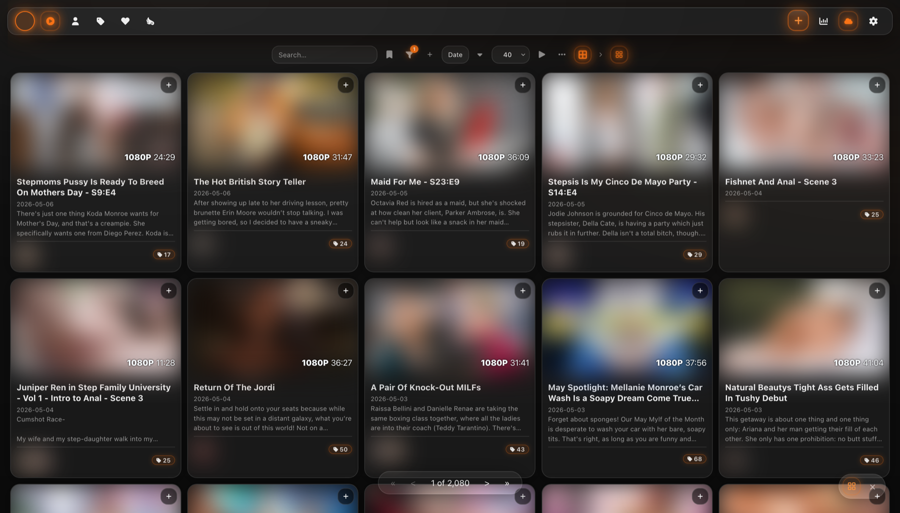
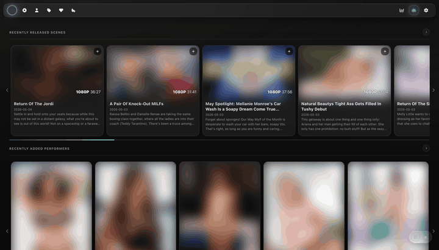
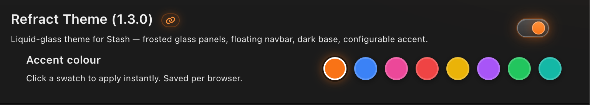
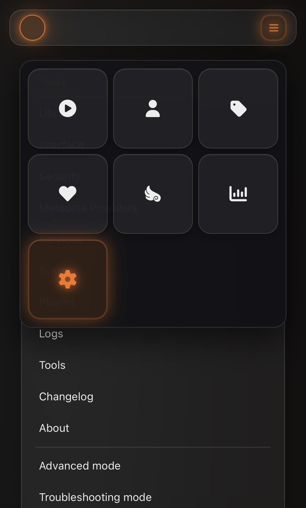

# Refract Theme

Liquid-glass theme for [Stash](https://github.com/stashapp/stash). Frosted glass panels, floating navbar, dark base, configurable accent.



## Features

- Glass-morphism re-skin of every Stash surface (cards, filters, scene player, settings, lightbox, scene tagger)
- 8 built-in accent presets + custom override via CSS variables — applies instantly, saved per browser
- Touch-only mobile burger menu — Stash's default nav is unusable on phones; Refract replaces the library row with a 3-column icon grid dropdown on `pointer: coarse` devices
- Horizontally-scrollable navbar at narrow desktop widths instead of icons collapsing one-by-one
- Donate link relocated from navbar into the settings sidebar (still discoverable, no longer cluttering the navbar at small widths)
- Theme-aware integration with [stash-multiview](https://github.com/ordureconnoisseur/stash-multiview) — accent flows into the multiview player via a localStorage handoff, including the standalone player page



The accent picker lives in **Settings → Plugins → Refract Theme** and applies live to every surface — navbar, cards, filter pills, scene tagger, and any companion plugin that's been theme-aware'd.



The mobile burger panel only shows on touch-input devices (`@media (pointer: coarse)`); resizing a desktop window down won't trigger it.



## Install

**Via Stash's plugin manager** (recommended once listed in CommunityScripts):
1. Settings → Plugins → Available Plugins
2. Find "Refract Theme" and click Install

**Manually**:
```bash
git clone https://github.com/ordureconnoisseur/stash-refract \
  ~/.stash/plugins/refract
```
Then restart Stash and enable the plugin in Settings → Plugins.

## Compatibility

- **Stash**: tested on 0.27.x. Older versions may work but aren't tested.
- **Desktop browsers**: Chrome ≥105, Edge ≥105, Safari ≥15.4, Firefox ≥121. Refract uses `:has()` extensively for context-aware styling, which gates the minimum.
- **Mobile**: iOS Safari 15.4+ and Chrome on Android. The burger menu is gated on `@media (pointer: coarse)` and only shows on touch-input devices.

## Recommended companion plugins

These plugins have UI integrations themed in Refract; they're not required:

- [stash-multiview](https://github.com/ordureconnoisseur/stash-multiview) — multi-scene player
- [stash-advanced-performer-rating](https://github.com/ordureconnoisseur/stash-advanced-performer-rating)
- [stash-advanced-scene-rating](https://github.com/ordureconnoisseur/stash-advanced-scene-rating)

## Customisation

### Accent colour presets

Refract ships with seven alternate accents in addition to the default orange. Open **Settings → Plugins → Refract Theme**, expand its panel, and click one of the eight colour swatches in the **Accent colour** row — orange (default), blue, pink, red, yellow, purple, green, or teal. The change applies instantly and is saved per browser; no refresh needed.

### Custom colour

For an accent that isn't in the preset list, override the four CSS variables via **Settings → Interface → Custom CSS**:

```css
body.stash-liquid-glass {
    --accent: #6366f1;
    --accent-bright: #818cf8;
    --accent-light: #c7d2fe;
    --accent-rgb: 99, 102, 241;
}
```

`--accent-glow` and `--accent-tint` derive from `--accent-rgb` automatically. See [`css/01_tokens.css`](./css/01_tokens.css) for the full variable list.

## Known limitations

- **Older Stash / older browsers**: Refract relies on `:has()` for context-aware styling. Stash 0.26 and earlier, or browsers older than the versions in [Compatibility](#compatibility), will get only partial styling.
- **`backdrop-filter` cost**: the frosted-glass look uses `backdrop-filter` heavily. Low-end GPUs and integrated graphics may notice scroll/animation jank, especially with the lightbox open over a busy page.
- **Third-party plugin UIs**: plugins that inject their own modals or panels (and don't reuse Stash's standard Bootstrap classes) won't be themed until Refract gets a rule for them. File an issue with the plugin name if you want one added.

## Credits

- Performer **Edit Tags** tab — image + description hover popup inspired by [Performer Tags Overhaul](https://github.com/RollainKraus/stash-plugins) by RollainKraus.

## License

[AGPL-3.0](./LICENSE)
